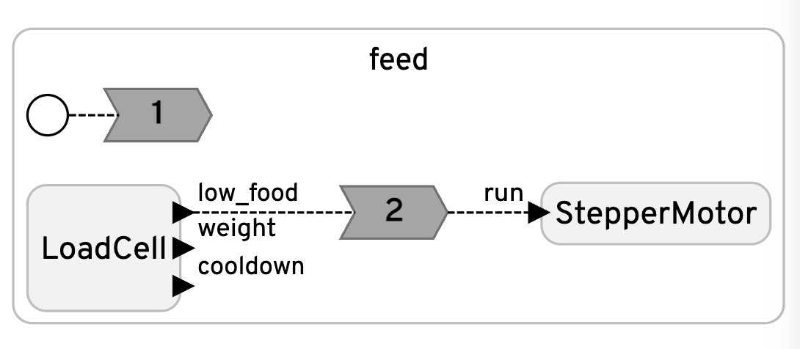
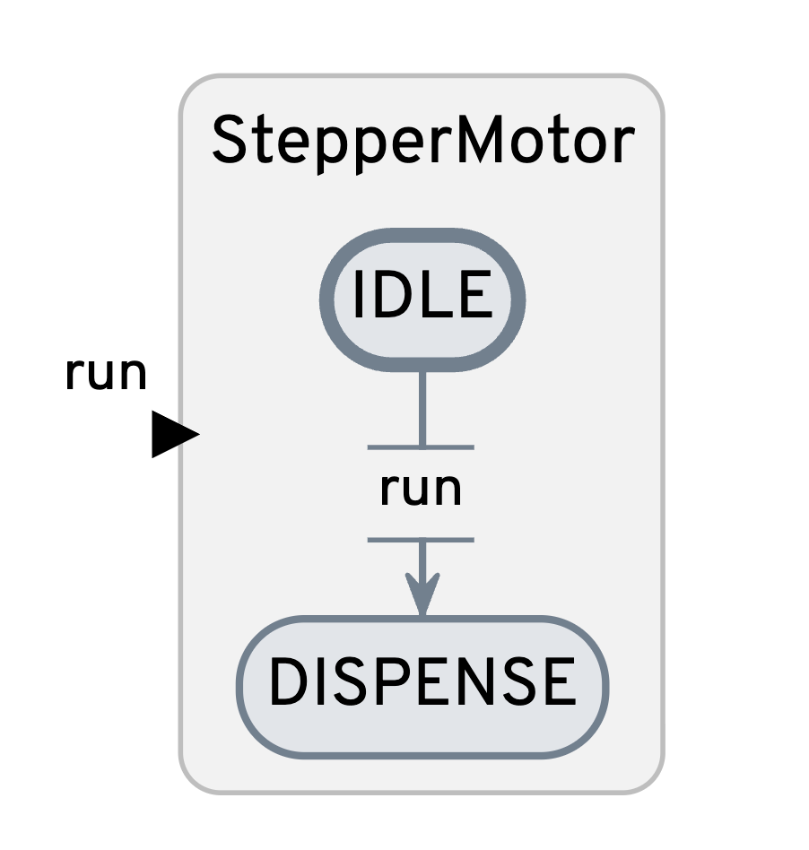
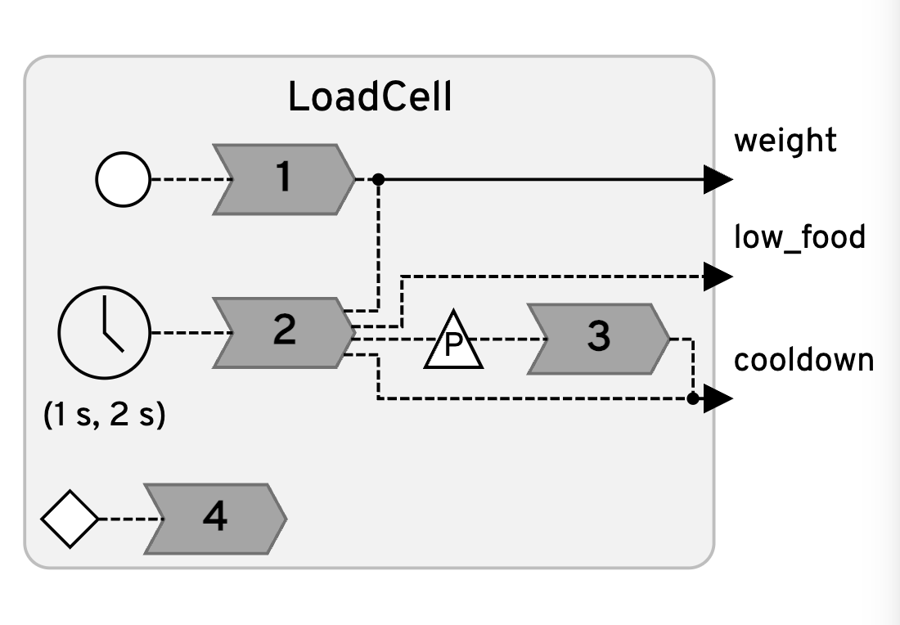

<h1 align="center">
  <br>
    Automated Cat Feeder
  <br>
</h1>

<h4 align="center">A weight-sensing pet feeder built with <a href="https://www.lf-lang.org/" target="_blank">Lingua Franca</a>.</h4>

<br>

<div display="block" align="center">
  <video width="600" controls>
    <source src="assets/demo.mov" type="video/mp4">
    Your browser does not support the video tag.
  </video>
</div>

---

## Overview

This project is an elementary automated pet feeder designed to run on a Raspberry Pi 4. 
If the food weight is below a certain threshold, the motor is triggered dispensing more food using an archimedes screw.

*Assumptions*
- Goal food weight: 50 - 60 grams
- Data pin= 5, Clock pin= 6
- Empty bowl placed to begin with


The goal is to ensure a pet always has the ideal amount of food (50-60 grams) while demonstrating how deterministic, reactive programming can be used to handle noisy sensor data, hardware interrupts, and mechanical dispensing logic safely.

---
## Usage
To compile and run this application, ensure you have Lingua Franca installed. From your command line:

```bash
# 1. Compile the main reactor
lfc feed.lf

# 2. Run the program (sudo is required for GPIO hardware priority)
sudo bin/feed
```
---

## Features

- **Real-Time Weight Monitoring:** Uses an HX711 amplifier to poll a load cell every second.
- **Median Data Filtering:** Takes 10 samples per reaction and calculates the median to smooth out noisy hardware readings.
- **Automated Dispensing:** Uses a modal model to switch a stepper motor from `IDLE` to `DISPENSE` when food drops below 50g.
- **Safety Cooldowns:** Detects anomalous readings (e.g., if a cat steps on the bowl) and automatically triggers a 10-second measurement pause to prevent overfeeding or motor burn-out.
- **Startup Calibration:** Interactive terminal prompt to establish a zero-weight offset for the specific bowl being used.

---

## Hardware Requirements

- **Raspberry Pi 4 Model B** (Primary controller running the LF application)
- **HX711 Load Cell Amplifier** (Wired to GPIO 5 for Data, GPIO 6 for Clock)
- **Load Cell** (Mounted to the base of the food bowl)
- **Stepper Motor & Stepper Hat B** (Wired to `MOTOR2` output for the dispensing mechanism)

---

## Software Requirements

- **Lingua Franca compiler** (`lfc`)
- **GCC toolchain** (`gcc`) for the C target
- **BCM2835 C Library** 
- **HX711 C Library** 

### Custom Library Modifications
To ensure real-time safety and hardware stability on the ARM-based Raspberry Pi, the standard `hx711.c` library was heavily modified for this project:
* **Memory Barriers:** Added `__sync_synchronize()` around direct GPIO register access to prevent CPU instruction reordering.
* **Precise Timing:** Replaced empty `for`-loop delays with explicit `usleep(1)` hardware delays.
* **Memory Management:** Stripped out dynamic memory allocation (`malloc`/`free`) to prevent fragmentation during long uptimes.

---

### Components(Reactors)
<table>
  <tr>
    <td> </td>
    <td> <strong><a href="feed.lf">feed.lf</a></strong>: The main reactor that instantiates the motor and loadcell components. It controls the startup sequence, prints the terminal interface, and acts as the central hub by routing the <code>low_food</code> signal from the scale to trigger the motor's dispensing logic.</td>
  </tr>
  <tr>
    <td> </td>
    <td> <strong><a href="lib/motor.lf">motor.lf</a></strong>: Manages the physical food dispensing mechanism. It uses a modal model to switch between <code>IDLE</code> and <code>DISPENSE</code> states, activating the HR8825 stepper motor driver to rotate a specific number of steps when commanded to feed.</td>
  </tr>
  <tr>
    <td> </td>
    <td> <strong><a href="lib/loadcell.lf">loadcell.lf</a></strong>: Handles the HX711 scale sensor. It takes median-filtered weight samples every two seconds, manages interactive startup calibration, evaluates the food level against ideal thresholds (50-60g), and enforces a 10-second safety cooldown if it detects anomalous readings.</td>
  </tr>
</table>

### Demo

### Contributor
Irene Fahndrich


To be done:
- overview
- usage
- hardware
- software(mod bcm + hx711 changes)


- demo
-

- assumptions
// TODO: potentially add interactive goal weight? email notif of feeding, take picture
//TODO:
// (1) potentially change pin input logic

